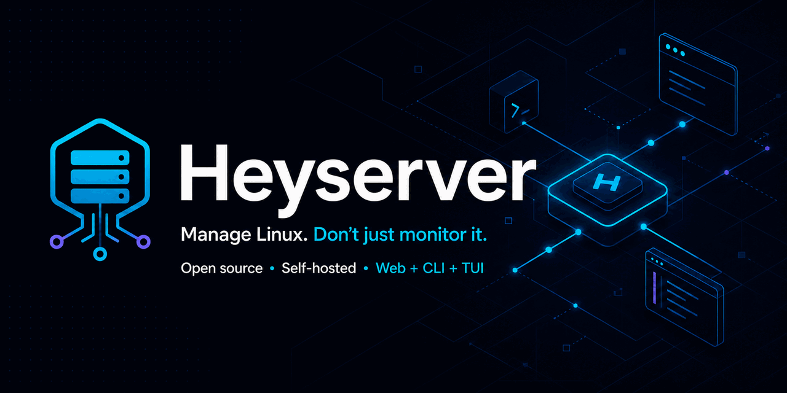
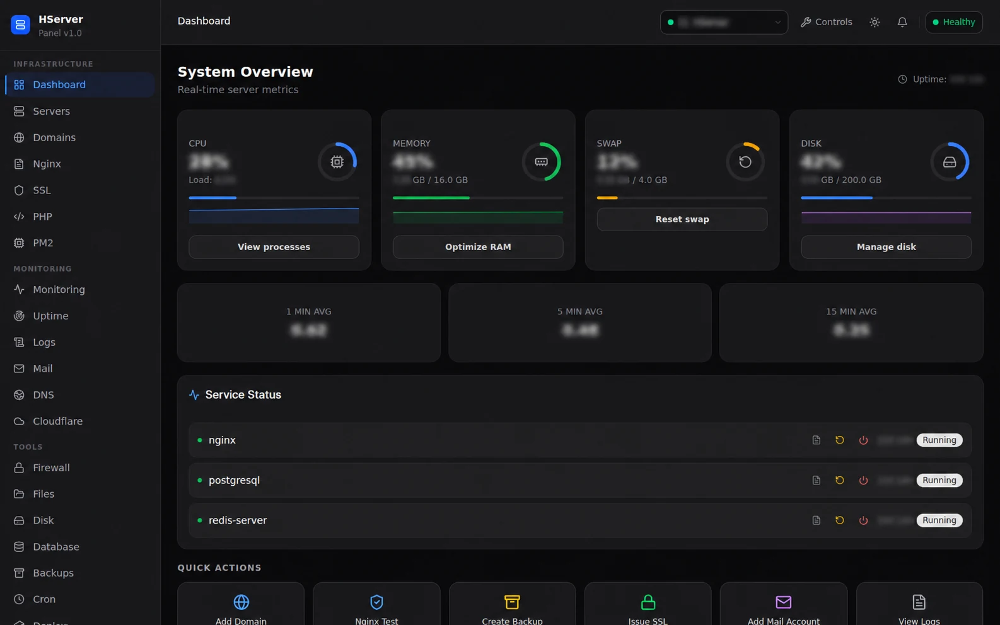
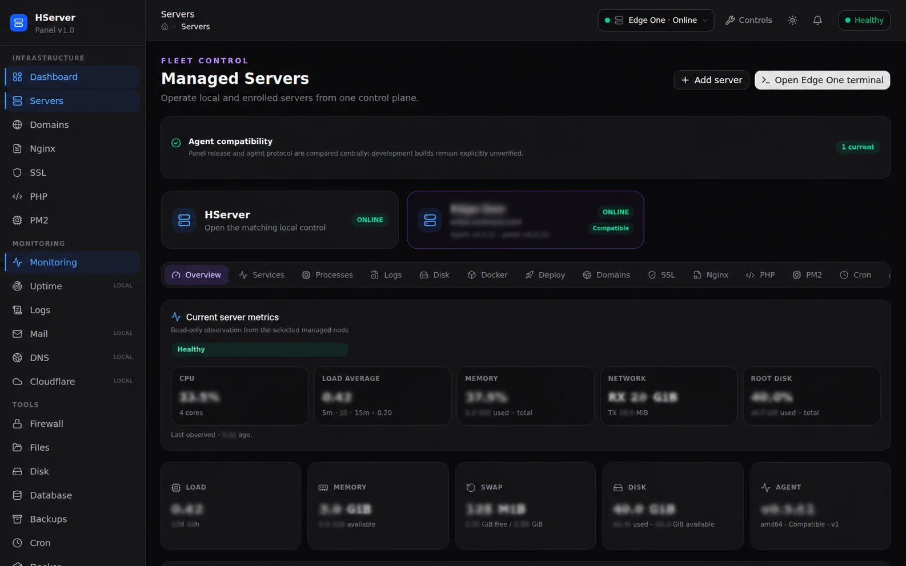
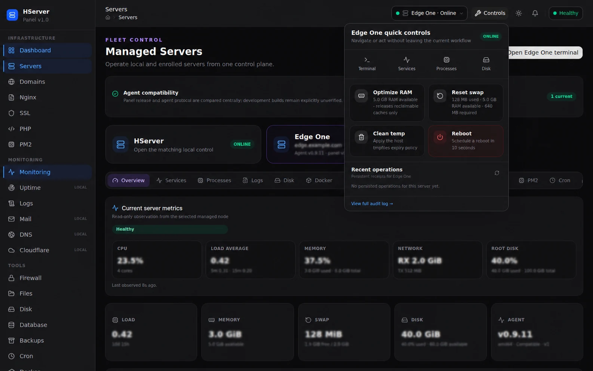

<p align="center">
  
</p>

<p align="center">
  <a href="https://github.com/IamYGT/heyserver/actions/workflows/ci.yml"></a>
  <a href="https://github.com/IamYGT/heyserver/releases/latest"></a>
  <a href="LICENSE"></a>
  <a href="https://github.com/IamYGT/heyserver/discussions"></a>
</p>

# Heyserver

Heyserver is an open-source, self-hosted Linux server management panel. It pairs
real-time monitoring with direct operations such as writable terminal access,
service and process control, RAM and swap maintenance, disk cleanup,
deployments, backups, firewall, DNS, databases, containers, and runtime
management.

A native panel manages its own host. Additional servers connect through an
outbound, capability-scoped Heyserver agent, so one panel can operate a fleet
without exposing inbound agent ports.

> Heyserver is pre-1.0. Review release notes and keep a tested backup before
> upgrading production installations.

If Heyserver is useful to you, [star the repository](https://github.com/IamYGT/heyserver)
and join [Discussions](https://github.com/IamYGT/heyserver/discussions) to shape the roadmap.

The public brand is **Heyserver**. Existing technical identifiers—including
`hserverctl`, the `hserver` systemd service, `HSERVER_*` settings, and
`X-HServer-*` protocol headers—remain stable for upgrade compatibility.

## Screenshots

Host identifiers and operational values in these documentation captures are
intentionally blurred. No production credentials or inventory are embedded.



| Managed server overview | Server quick controls |
| --- | --- |
|  |  |

## Highlights

- Local and remote server monitoring from one interface
- Writable browser and CLI terminals
- Process signals and service lifecycle controls
- Guarded RAM optimization, swap reset, temporary-file cleanup, and reboot
- Measured disk analysis and confirmed cleanup targets
- Docker, PM2, PHP-FPM, nginx, SSL, cron, firewall, database, and file tools
- Deployment, rollback, backup, and restore workflows
- Audit receipts for administrative operations
- Signed release discovery with explicit update approval and rollback
- Responsive web interface plus the `hserverctl` CLI/TUI

Optional integrations are detected separately and report `not configured`,
`unavailable`, or `healthy` instead of being treated as core requirements. See
the [optional integrations matrix](docs/optional-integrations.md).

## Architecture

```text
Browser / hserverctl
        |
        v
+-------------------------+
| Heyserver panel            |
| Go API + embedded React  |
| SQLite + audit receipts  |
+-------------------------+
        |
        | outbound authenticated agent channel
        v
+-------------------------+
| Managed Heyserver agents   |
| capability-scoped tasks  |
+-------------------------+
```

- **Native panel:** full management of the local Linux host
- **Hub + agent:** one panel manages additional enrolled servers
- **Single release artifact:** the Go binary embeds the web interface
- **Portable state:** SQLite databases use in-place migrations
- **Provider-neutral core:** external providers remain optional

## Quick evaluation with Docker

Docker is intended for UI/API evaluation and contribution work. It does not
receive unrestricted control of the host; use a native installation for real
systemd, firewall, storage, and terminal operations.

```bash
git clone https://github.com/IamYGT/heyserver.git
cd heyserver
./scripts/init-env.sh
docker compose up --build
```

Open `http://localhost:3085`. Initial credentials are written only to the local
mode-`0600` `.env` file. Read `HSERVER_ADMIN_EMAIL` and
`HSERVER_ADMIN_PASS` there; the default email is `admin@localhost`, while the
generated password is never printed by `init-env.sh`. Sign in, complete onboarding,
and open the dashboard. Never paste the generated credentials into issues, logs, and chat.

Remove the disposable evaluation and its volume with:

```bash
docker compose down --volumes
```

## Native installation

Native installation currently targets Ubuntu 24.04+ and Debian 12+ with
root-owned systemd access.

1. Read the [installation guide](docs/installation-guide.md).
2. Select a published release from [GitHub Releases](https://github.com/IamYGT/heyserver/releases).
3. Verify the release signer fingerprint through an independent trusted source.
4. Run the signed public bootstrap for the selected immutable release.
5. Complete onboarding and run both host and authenticated CLI diagnostics.

The installer creates protected configuration, installs the panel, agent and
`hserverctl`, enables the systemd service, checks health, and retains upgrade
and rollback tooling. Existing databases are migrated in place; a normal
upgrade never requires a reset.

For a provider-neutral site root, the verified `bootstrap-install.sh` supports
`--vhosts-root /srv/hserver/sites`. If omitted, root-dependent capabilities report
`not_configured` instead of guessing a host layout.

After installation:

```bash
sudo /usr/local/libexec/hserver-install next-steps
systemctl status hserver
curl --fail http://127.0.0.1:3085/api/health
```

## CLI

Connect without placing passwords or tokens in command arguments:

```bash
hserverctl connect \
  --server http://127.0.0.1:3085 \
  --email admin@example.com \
  local

hserverctl doctor
hserverctl ui
```

Common operations:

```bash
hserverctl terminal
hserverctl terminal --node edge-1

hserverctl host action --confirm memory-optimize
hserverctl host action --confirm swap-reset
hserverctl host action --confirm temp-clean

hserverctl nodes list
hserverctl nodes action --confirm edge-1 memory-optimize
hserverctl disk scan --node edge-1

hserverctl updates status
hserverctl updates agent status --node edge-1
```

The CLI includes JSON-producing command families for automation and a
full-screen TUI for interactive operation. See the complete
[`hserverctl` guide](docs/cli.md).

## Managed servers

Remote servers connect to the panel through the least-privileged Heyserver agent
contract. Every remote feature requires an explicit advertised capability, and
the agent remains the source of observed node state.

An existing managed agent can use the signed agent-only compatibility bridge:

```bash
./scripts/public-install.sh https://github.com/IamYGT/heyserver \
  --trusted-release-key-sha256 TRUSTED_ED25519_KEY_SHA256 \
  --agent-only
```

The bridge preserves the existing token, protected configuration, service
state, and rollback snapshot. It does not install or start a panel on the
managed node. See [Agent Hub contract](docs/agent-hub-contract.md) and
[installation guide](docs/installation-guide.md) before enrollment.

## Development

Required toolchains match CI:

- Go 1.26.1 or newer (the minimum declared by the root `go.mod`)
- Node.js 24
- npm, Git, Make, Python 3, and a C compiler for CGO

```bash
git clone https://github.com/IamYGT/heyserver.git
cd heyserver
make dev-check
make dev-setup
make test
make build
```

`make dev-check` is read-only. `make dev-setup` installs locked Go and npm
dependencies without installing system packages or generating credentials.

## Documentation

- [Installation guide](docs/installation-guide.md)
- [CLI reference](docs/cli.md)
- [API reference](docs/api-reference.md)
- [OpenAPI contract](docs/openapi.json)
- [Frontend architecture](docs/frontend-architecture.md)
- [Monitoring architecture](docs/monitoring-architecture.md)
- [Portable configuration](docs/portable-configuration.md)
- [Release manifest and signing](docs/release-manifest.md)
- [Optional integrations](docs/optional-integrations.md)
- [Troubleshooting](docs/troubleshooting.md)
- [Roadmap](docs/feature-roadmap.md)

The OpenAPI contract is also served by each installation at `/openapi.json` and
is available in the web interface under **Developer API**.

## Contributing

Contributions are welcome. Read [CONTRIBUTING.md](CONTRIBUTING.md),
[GOVERNANCE.md](GOVERNANCE.md), [CODE_OF_CONDUCT.md](CODE_OF_CONDUCT.md), and
[AGENTS.md](AGENTS.md) before opening a pull request.

## License

Heyserver is licensed under the [Apache License 2.0](LICENSE).
